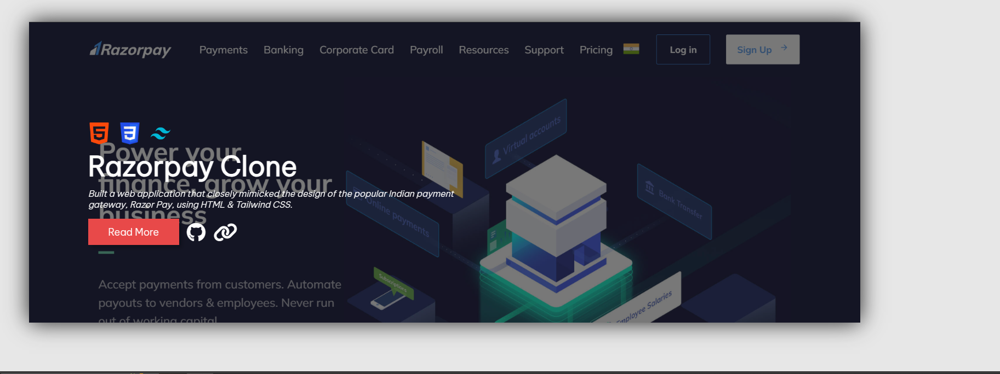

# My Portfolio Website

This is a simple portfolio website I created as my first task during my Bharat intern. It showcases my skills, projects, and contact information.

## Demo
You can view a live demo of this portfolio website [here](https://www.example.com).

## Features
- Home section with a brief introduction
- Projects section to showcase your work
- Skills section to highlight your skills
- Contact section with contact information
- Responsive design for mobile and desktop

## Technologies Used
- HTML
- CSS
- [Optional] JavaScript for interactivity

## Screenshots

